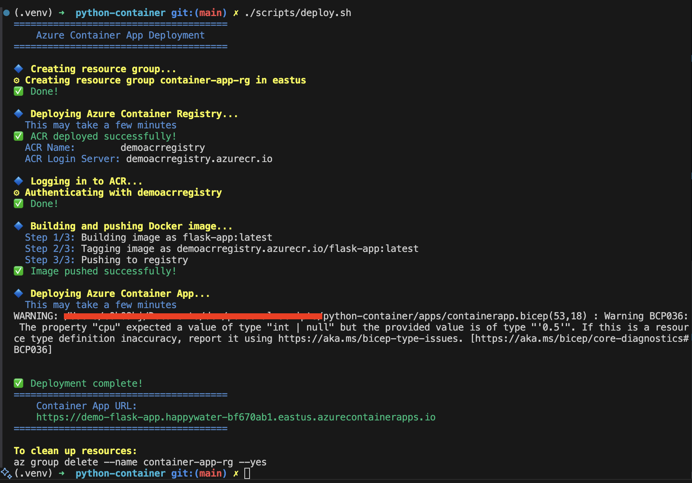

# Basic Containerized Python Application

This repository hosts all components needed to build a containerized API with Python and Flask.

It also includes Bicep and scripts to deploy to Azure Container Apps and Azure Kubernetes Service.

## Prerequisites

- Docker CLI installed
- (Optional) Python 3.13+ for testing

## Local Instructions

### Build Local Container Instructions

```bash
docker build -t my-flask-app .
```

### Run the containerized application locally

```bash
docker run -p 5000:5000 my-flask-app
```

## Deploy to Azure Container Apps

### Container Apps Prerequisites

- Docker daemon running
- Logged into `az` command line

```bash
az login
```

### Run the deployment script

```bash
chmod +x scripts/apps_deploy.sh
./scripts/apps_deploy.sh
```



### Show the contianer scaling

Once the deployment script is complete, copy the URL from the deployment output and input into the following command to scale the containers. Replace `<url>` with the URL from the output.

```bash
hey -n 10000 -c 100 -z 3m <url>
```

In the Azure console navigate to your container app -> Application (left hand side) -> Revisions and Replicas -> Replicas (tab).

### Delete Resources

```bash
az group delete --name container-app-rg --yes
```

## Deploy to Azure Kubernetes Service

### AKS Prerequisites

- `kubectl` installed
- Docker daemon running
- Logged into `az` command line

```bash
az login
```

### AKS Deploy

```bash
./scripts/k8s_deploy.sh
```


### Delete AKS Resources

```bash
az group delete --name flask-app-rg --yes --no-wait
```
